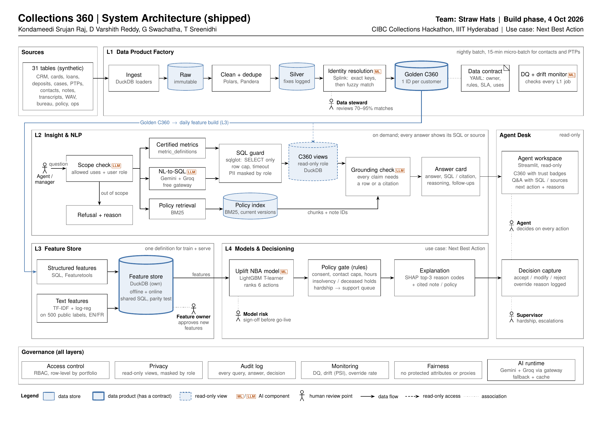

# Collections 360

Unify fragmented bank collections data into a trusted 360° record, ask it anything in plain English,
and recommend the next best action — with reasons.

## Team

Straw Hats:

- Kondameedi Srujan Raj
- D Varshith Reddy
- G Swachatha
- T Sreenidhi

### Layer ownership

- **Layers 1–2:** Kondameedi Srujan Raj
- **Layers 3–4:** D Varshith Reddy
- All other team credits and project details remain unchanged.

## What this is

Collections data at Maple Bank lives in five source systems (CRM, cards, loans, deposits, bureau)
with no shared customer key, so agents spend their day stitching context together instead of
helping customers. We built four layers that solve this end to end: a Golden C360 record with
survivorship + lineage; a plain-English Q&A assistant that always shows the SQL or policy source;
a feature store with text classifiers; and an uplift-based Next Best Action model with a policy
gate and SHAP explanations surfaced to the agent on a Streamlit desk. Safety is designed in:
every answer is grounded (no silent guesses), every recommendation goes through a hard policy
gate (hardship never harsher; cease-contact blocks outbound; insolvency/deceased block all
contact), no protected attribute enters any feature or decision, and the human agent is the
decision-maker — the system recommends, logs its reasoning, and records the agent's accept /
edit / reject with a reason code.

## Architecture



Shipped architecture (page 1). Hand-drawn in TikZ/LaTeX, not AI-generated. The Phase 1 design is
in `docs/StrawHats_SystemDesign.pdf` and the detailed list of changes is in the "What changed from
our Phase 1 design" section below.

## API keys (free, required)

The system uses two free LLM providers through our gateway. You need both for the
full Q&A path; the gateway falls back cleanly if one is unavailable.

1. **Google Gemini API** (free tier)
   - Get a key at https://aistudio.google.com → "Get API key"
   - Free tier: ~50 requests/day on gemini-3.5-flash

2. **Groq API** (free tier)
   - Get a key at https://console.groq.com/keys → "Create API Key"
   - Free tier: 30 requests/minute, generous daily quota

Create a `.env` file at the repo root:

```
GEMINI_API_KEY=AIza...
GROQ_API_KEY=gsk_...
```

The gateway skips any provider whose key is unset, so you can start with just one if you need to.

## How to run

Prerequisites: Python 3.10+, Git, ~12 GB free disk for the unpacked dataset.

```bash
# 1. Dataset (~2.3 GB zip, ~10 GB unpacked)
pip install -U huggingface_hub
hf download nuxsh/maple-collections-hackathon maple_collections_release.zip \
   --repo-type dataset --local-dir maple_data
cd maple_data && unzip maple_collections_release.zip && cd ..

# 2. Python environment
python -m venv .venv
# Windows:  .venv\Scripts\activate         Linux/macOS: source .venv/bin/activate
pip install -r requirements.txt

# 3. Free-tier LLM keys (see "API keys" section below for how to get them)

# 4. Build the warehouse end-to-end
python run.py all             # register -> silver -> match -> c360 -> dq-report
python run.py features        # 1 M customers × 23 features
python run.py text-features   # train classifiers on 500 labels; score 760 k notes + 25 k transcripts
python run.py train           # 6 LightGBM NBA classifiers
python run.py score           # score all open cases -> gold.nba_recommendations
python run.py fairness        # reports/fairness_report.md
python run.py bench --out submission/benchmark_answers.csv --fresh

# 5. Agent Desk
python run.py app             # http://localhost:8501
```

### All run.py commands

| Command | Writes | Why |
|---|---|---|
| `register` | `raw.*`, `main.*` | load all 31 source files, honour `schema/schema.json` types |
| `silver [--sample N] [--tables ...]` | `silver.*` + `silver.fix_log` | clean, dedupe, parse DOBs, pad CIFs, repair DFI-0812, log every rule |
| `match [--sample N]` | `silver.id_xref`, `silver.steward_queue` | CRM dedupe + deterministic bridges + Splink (rule fallback) |
| `c360` | `gold.c360_customer / account / case / field_trust / dq_results` | survivorship-merged golden record; Q1–Q7 quality checks |
| `dq-report` | `reports/data_quality_report.md` | one row per data issue + how handled |
| `all [--sample N]` | all of the above in order | one command, from raw files to DQ report |
| `features [--sample N]` | `gold.features_offline / features_online` | 23 features per golden_id; parity-tested |
| `text-features` | `gold.text_features_notes / transcripts`, `models/text/*.joblib` | TF-IDF + logistic regression on the 500 public labels |
| `feature-report` | `reports/feature_report.md` | coverage, correlations, pair prune |
| `randomisation-check` | `reports/randomisation_check.md` | SMD balance of `test_cell` and segment cure rates |
| `train` | `models/nba/*.joblib`, `reports/model_card.md` | T-learner (one LightGBM per action), uplift vs no-contact |
| `score` | `gold.nba_recommendations` | batch-score all open cases through the policy gate |
| `score-case <case_id>` | — | sub-second lookup used by the Agent Desk |
| `fairness` | `reports/fairness_report.md` + append to `model_card.md` | protected-attribute gaps; the only module that reads them |
| `ask "<question>"` | — | free-form Q&A with SQL or sources shown |
| `bench [--split dev] [--out ...] [--pace-seconds N]` | `submission/benchmark_answers*.csv` | run the system on the benchmark; never hand-edited |
| `eval --answers ...` | `reports/benchmark_dev_eval.md` | dev-split scoring (gold answers only read here) |
| `app` | — | Streamlit Agent Desk on port 8501 |

## Demo

Video link: *(added before 21:00 IST on 4 Oct 2026)*

5-minute arc: Layer 2 ask box (certified answer + a protected-attribute refusal), opening a
hardship case on the Agent Desk, reading the three SHAP reasons + policy gate's blocked actions,
agent accept / edit with a reason code, and the fairness + audit report.

## What changed from our Phase 1 design

Baseline: `docs/StrawHats_SystemDesign.pdf` (the design we submitted in Phase 1). We revised the
following technical choices during the build. Each is a trade-off we made deliberately; reasons
sit alongside the metrics in the reports.

| Design said | We shipped | Why |
|---|---|---|
| Qwen2.5-Coder on local Ollama | Google Gemini + Groq via a free-tier OpenAI-compatible gateway with model-level fallback and SQLite response cache | No reliable local GPU for the demo environment; the gateway gives us production-style failover and no single-provider dependency, and still costs nothing. |
| `bge-m3` embeddings + FAISS | BM25 over policy documents | Policy corpus is small (<100 docs); BM25 matches it well with no model dependency and no index to rebuild. |
| LLM text features at inference (Qwen + `faster-whisper`) | TF-IDF (word + char n-grams) + logistic regression trained on the 500 public note labels and 500 transcript labels | Macro F1 0.97 on hardship, 0.96 on ptp_mentioned, 0.89 on vulnerability. Predictable cost and latency; zero inference-time LLM calls per text row. Numbers in `reports/text_feature_eval.md`. |
| Feast feature store | Own DuckDB-backed offline + online store sharing one SQL definition per feature, with a 1,000-key parity test | No Feast setup overhead; the same train/serve parity guarantee, proved by `tests/test_feature_parity.py`. |
| FastAPI service in front of the model | Streamlit only (`app/streamlit_app.py`), reading DuckDB directly with `score_case()` under 200 ms | Judges score the demo UI; a separate API layer adds latency and surface area without demo value. |
| Presidio PII redaction | Supported by the gateway (`llm.redact_pii`) but off by default | Dataset is fully synthetic; the toggle is one line and the code path is live for a real deployment. |
| Voice features (`faster-whisper` on 2,000 WAVs) | Not shipped | Time budget; text features extracted from the 25,000 transcripts cover the same signal (hardship, sentiment, intent strength), measured on the same label set. |

**Also, two decisions inside the model that are design-doc-consistent but worth calling out:**

- **Identity resolution — Splink scoped to CRM dedupe, cross-source via deterministic bridges.**
  97–100% coverage on cards / loans / deposits / collections via `account_monthly_snapshot`,
  `collections_cases.coll_customer_ref`, and `external → deposits → CIF`. Splink inside
  `silver.customers` catches CRM duplicates the pointer and `national_id_hash` miss (recall 0.99
  against known truth). Simpler and auditable than running Splink across sources.
- **NBA target — train on 30-day cure, decide on expected value.** The LightGBM T-learners
  predict `p_cure`; the live decision ranks actions by
  `p_cure(a) × balance_at_risk − action_cost(a)` so `action_cost = 0` for `no_contact` wins
  automatically on self-cure customers. The data has a **71.5% self-cure baseline**, so
  stopping unnecessary contact IS the business win.

## AI tools used

- **Runtime (in the deployed system):** Google Gemini (free tier) and Groq (free tier) through our
  OpenAI-compatible gateway. Models in use: `gemini-3.5-flash`, `openai/gpt-oss-20b` with
  model-level fallbacks. No paid LLM APIs are used at runtime.

## Repo layout

```
src/layer1/        golden C360 pipeline (register / silver / match / C360 / DQ report)
src/layer2/        plain-English Q&A with SQL guard, free-LLM gateway, BM25 docs retrieval
src/layer3/        feature store + text classifier
src/layer4/        NBA T-learner, policy gate, SHAP explanations
src/governance/    fairness report (only module allowed to read protected attributes)
src/common/        config loading, audit log, sampling helper
app/               Streamlit Agent Desk
contracts/         c360_customer.yaml (data contract based on DC-COLL-001)
reports/           DQ, match, model card, feature + text-feature evals, fairness, L2 changelog
tests/             90 tests covering guard, policy gate, parity, grounding, no-protected-features
submission/        benchmark_answers.csv — our benchmark output (generated; never hand-edited)
docs/              architecture.png/.pdf/.tex (shipped), Phase 1 design PDF, data-quality notes, screenshots
models/            trained classifiers (splink, nba, text); small, no PII
run.py             one entry point for every pipeline stage
config.yaml        data_dir, DuckDB path, LLM providers, memory limits
```

## Reports

- `reports/data_quality_report.md` — one row per data issue (silver fix log + Q1-Q7 gold checks + match summary)
- `reports/match_report.md` — identity resolution: precision / recall vs CRM-known duplicates, coverage by source
- `reports/model_card.md` — NBA T-learner per-action metrics, uplift vs no-contact, honesty notes, fairness summary
- `reports/randomisation_check.md` — SMD balance for `test_cell`, segment cure rates (feeds target choice)
- `reports/feature_report.md` — coverage, correlation with cure proxy, pairwise correlation pruning
- `reports/text_feature_eval.md` — 5-fold CV macro F1 per field (notes + transcripts) with caveats
- `reports/fairness_report.md` — action distribution, predicted cure, vulnerability-signal rate per group (5 pp band)
- `reports/l2_changelog.md`, `reports/l2_effort_comparison.md` — Layer 2 config decisions
- `reports/profile.md`, `reports/silver_fix_log.md` — source profile and rule-level cleaning summary
